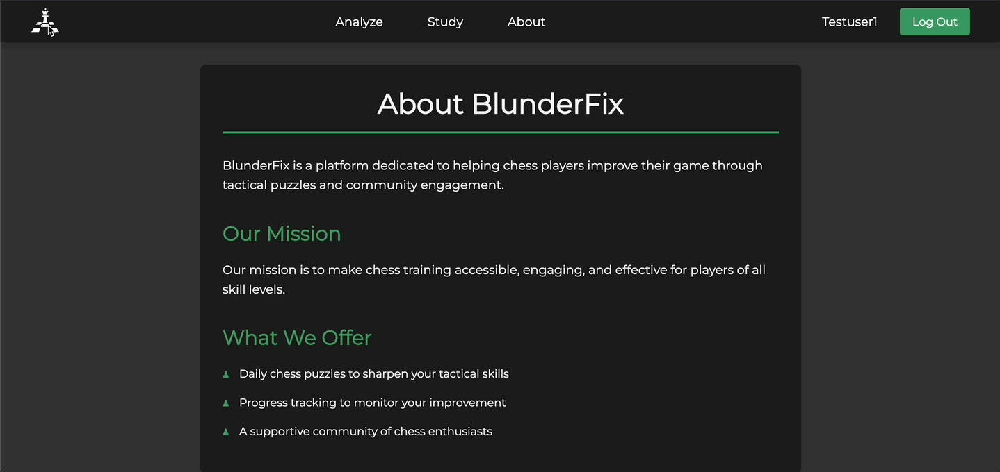

# Chess Training Platform

## Description
A web-based platform built for chess enthusiasts to sharpen their skills. It offers themed puzzles with varying difficulty levels, progress tracking, user ratings, and interactive gameplay with stockfish analysis and saving capabilities. Also common endgames you can play against engine.

---

## Stack
  - PostgreSQL
  - Django 
  - Vanilla JavaScript for chess logic and interactive UI, with no external libraries. 

## Demo

