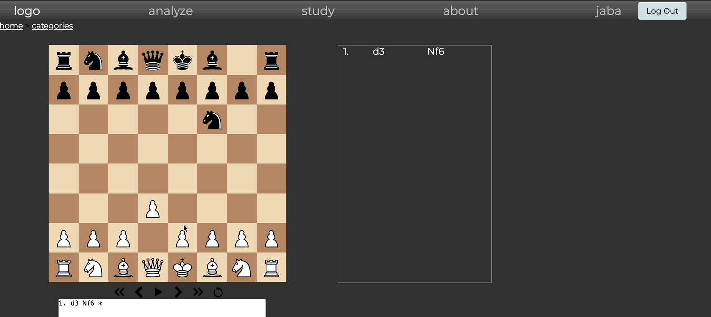

# Chess Training Platform

## Description
A web-based platform built for chess enthusiasts to sharpen their skills. It offers themed puzzles with varying difficulty levels, progress tracking, user ratings, and interactive gameplay with move-by-move analysis and saving capabilities.

---

## Stack
  - PostgreSQL
  - Django 
  - Vanilla JavaScript for chess logic and interactive UI, with no external libraries. 

## Demo

